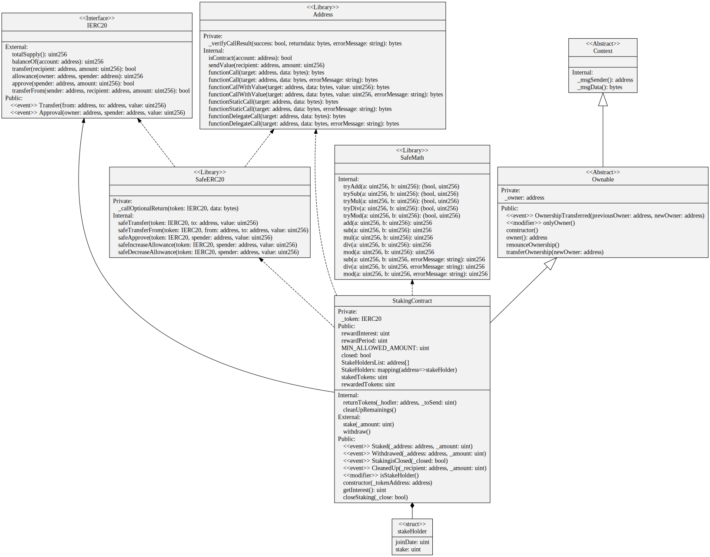

# Quadrans Staking contract

This repository contains the smart contracts used to implement the staking feature on the QDT token. 
Quadrans foundation allows token holders to lock some of theyr tokens in a smart contract for a period of time in order to receive an **APY (Annual percentual yield) of 14%**.

The staking is **fully transparent by desing** and all the staking process is fully transparent as any relevant information can be checked at any moment by anyone.

## Index
* [General Info](#general-info)
* [Used technologies](#used-technologies)
* [Functions](#functions)
* [Structure](#Structure)
* [Screenshot](#screenshot)
* [Install](#install)
* [How it works](#how-it-works)
* [Product Status](#product-status)

## General Info

The Staking contract works in pair with the ERC20 QDT contract. It acts as a wallet on the QDT contract and can hold and release tokens.
Any holder can lock up funds in the Staking contract. In order for the stake to be valid:
- the holder must lock at least 10-13 tokens (100000 in wey).
- the stake contract must be in `open` state (see later) 
- the holder must not have already staked tokens with the same address (each address can stake once at a time)

There is no minimum wait time to wait before redrawal, the interest will be calculated on the effective time the tokens were staked

## Used technologies
- Quadrans blockchain
- OpenZeppelin libraries
- EIP20 token standard

## Functions

There are 3 public functions:
- `stake(amount)`: allows any holder to give tokens to the staking contract. The amount of tokens must be above the minumum and the holder
must not have active stakes with the same address. 
- `withdraw()` : the holder claims his/hers token back along with the yield he deserves based on the time the tokens were staked 
- `getInterest()` : the holder can ask how much yield he should receive if withdraws now.

There are also 2 functions available to the smart contract owner only
- `closeStaking(bool)` : this funcion allows the smart contract owner to closed (if called with `true`) or reopen (if called with `false`). Closing the staking can be temprorary. Il the owner closes the staking all hodlers will get theyr tokens black plus yield. Then the owner will receive the remainings of the liquidity pool, if any. While the staking is closed holders cannot stake tokens.
- `cleanUpRemainings()` : the smart contract owner claims back the remainings of the liquidity pool in the contract. In order to use this function the staking contract must be in `closed`state

## Structure

The staking smart contract has the address of the ERC20 token it refers to. A part from that the contract uses the following dependecy diagram

## Screenshot
- NA

## Install
You do not need to install this token smart contract as it is already in prodiction . You can find the deployed contract on Ethereum main net

There is also a test deploy on **Ropsten** testnet that can be found here:

- Etherscan : https://ropsten.etherscan.io/address/0x534B8C3D843B76F5c96F03B5A6662c410819bD70
- Deploy Transaction: 0x90d697865d9bb767a8229bd7531aecc3c1ff9eff76f8dbe558ddfcc78d76f0e6
- Smart contract Address : 0x534B8C3D843B76F5c96F03B5A6662c410819bD70
- Smart contract Owner : 0xcc5a1bc08aba4b2cb513878e1f097350d4e4cc32
- Test ERC20 Token : 0xa37aF6ea85E65C756715e0454aAEEBd1DD1159CE

## How it works

The general lifecicle of the main functions is as follow:

Deploy and setup phase:
- the smart contract owner deploys the conctract
- when deploying the address of the ERC20 token is passed to the constructor
- the smart contract owner gives to the smart contract an amount of tokens to serve as a liquidity pool. This tokens will be used to pay the interests.
- the smart contract can/should repeat the previous operation when needed

User Staking:
- the holder and and should run a series of checks before staking
- since all the variables of the contract are public, the holder can have a clear view of the situation at any moment
- in particular the holder should check the number of stakers and their amount of staked tokens to make sure the liquidity pool is full enought
- after that the holder can decide if stake, how much, for how long
- in order to do that the holder must instruct the ERC20 and give an allowance to the staking contract equal to the amount he/she wants to stake
- after that the holder can stake the that amount of tokens
- the staking contract will get the tokens from the ERC20 contract, annote the amount and the time the staking was done to later compute the yield at the withdraw

User Withdraw:
- the holder/staker asks for a withdraw
- the staking smart contract computes the yield
- the staking smart contract sends the tokens+yield to the holder address in the ERC20 contract.

Closing the Stake:
- the smart contract owner calls for a close in the stake
- all stakers receive their staked tokens+yield on the ERC20 token contract like if they asked for a withdraw (but without paying for the fees)
- any token left in the liquidity pool is sent to the smart contract owner
- any stake request from this moment is denied until the smart contract owner opens the staking again

See [EIP20](https://eips.ethereum.org/EIPS/eip-20) for further information

## Product Status
The product is: _deployed in production on Ethereum Mainnet_